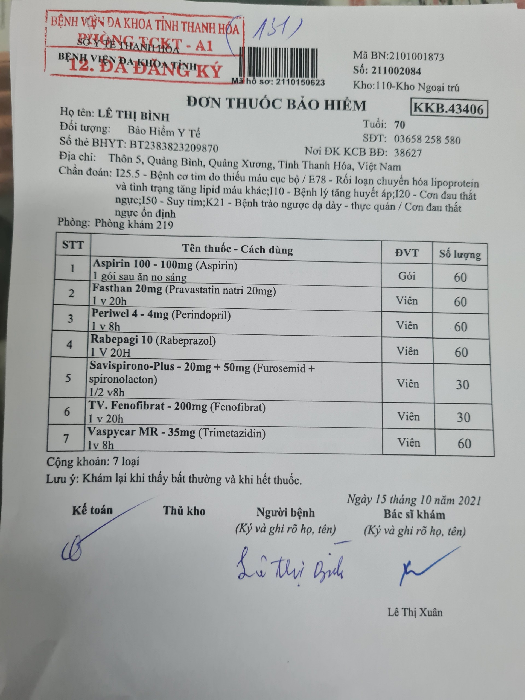
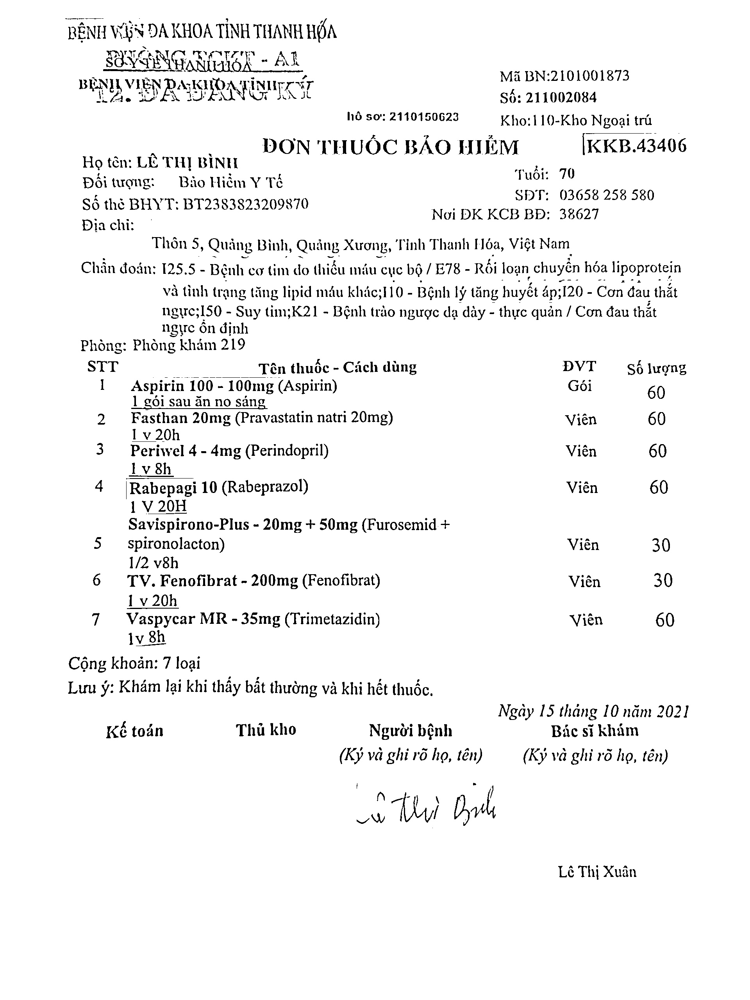

# Bill Preprocess for Better OCR
## Problem
I'm doing a OCR model in Bill information extracting. But not always our data is good enough. This repo is to make the image ready for classification phase.
From this

To this

## Pipeline
1. Image rotation using OpenCV
1. Text detection using Paddle OCR
1. Maping detected box in a new image using pyimagesearch
## Use

Clone this repo

'''
git clone https://github.com/mhai247/Bill_Preprocess_OCR
cd Bill_Preprocess_OCR
'''
Install require package

'''
pip install -r requirement.txt
'''

Test the avaiable dataset

'''
python3 scan.py
'''

Copy your dataset into data folder
Run in your dataset

'''
python3 scan.py --image_dir YOUR_DATASET_NAME
'''

Opensource code
[pyimagesearch](https://www.pyimagesearch.com/2014/08/25/4-point-opencv-getperspective-transform-example/)
[PaddleOCR](https://github.com/PaddlePaddle/PaddleOCR)