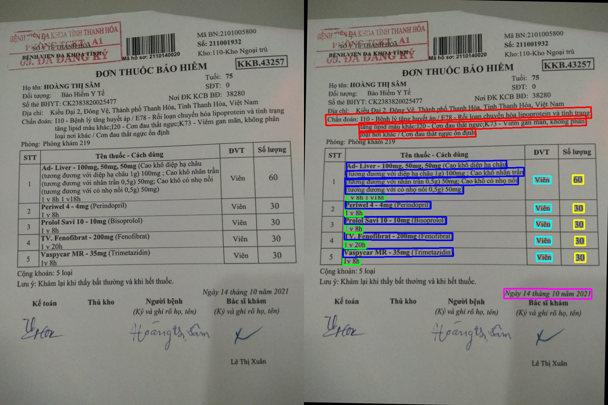

# Text Image Scan
## Introduciton
This repo is to scan and extract info from bill images.
Like this

## Pipeline
1. Image rotation using OpenCV
1. Text detection using Paddle OCR
1. Use rule to extract key info
1. OCR
## Use

Clone this repo

```
git clone https://github.com/mhai247/Text_Image_Scan
cd Bill_Preprocess_OCR
```
Install require package

```
pip install -r requirement.txt
```

Test the avaiable dataset

```
python3 main.py --dataset test --use_gpu True --visualise True
```

Copy your dataset into data folder
Run in your dataset

```
python3 scan.py --dataset YOUR_DATASET_NAME
```

## Opensource code
[pyimagesearch](https://www.pyimagesearch.com/2014/08/25/4-point-opencv-getperspective-transform-example/)

[PaddleOCR](https://github.com/PaddlePaddle/PaddleOCR)

[vietocr](https://github.com/pbcquoc/vietocr)